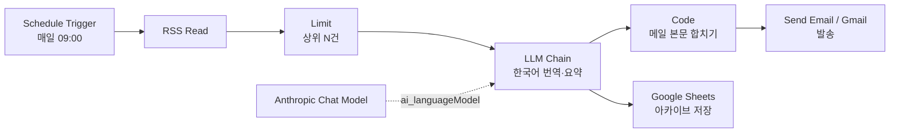

# 06. 프로젝트 — 영어 AI 뉴스 → 한국어 요약 → 이메일

[04번 노트](04_patterns.md)의 "요약 봇" 패턴을 실제로 만든다. 영어 AI 기사를 매일 받아 한국어로 번역·요약하고, 하나의 다이제스트 메일로 보낸다.

## 완성 모습



기사 여러 건이 들어오면 RSS/LLM 노드는 **item마다 한 번씩** 돈다([02번 노트](02_data-flow.md)). 요약 노드의 출력은 메일용 Code와 Sheets 저장으로 **동시에 분기**된다(한 노드의 main 출력을 여러 노드에 연결).

> 위 도식은 Mermaid로 작성돼 GitHub에서 그림으로 렌더링된다. n8n 캔버스의 실제 화면은 PNG 내보내기가 없어 스크린샷으로만 남길 수 있고, 그래프의 "원본"은 [`workflows/news-summary-bot.json`](workflows/news-summary-bot.json) — 이 파일을 n8n에 import하면 같은 노드 그래프가 그대로 복원된다.

## 소스 선택 — 왜 MIT Technology Review인가

원래 목표였던 **DeepLearning.AI The Batch는 공식 RSS가 없다**(10년째 미제공). RSSHub 우회로(`rsshub.app/deeplearning/the-batch`)가 있지만 공개 인스턴스가 Cloudflare 챌린지로 막혀 서버 자동화엔 불안정하다.

대신 공개·안정·본문 포함인 피드를 쓴다:

```
https://www.technologyreview.com/topic/artificial-intelligence/feed/
```

- HTTP 200, 기사 10건, `content:encoded`에 본문 6~8천 자가 통째로 들어온다 → 별도 본문 크롤링 불필요.
- 영어 AI 기사라는 조건 충족. 나중에 소스를 바꾸려면 RSS Read 노드의 URL만 교체하면 된다.

다른 안정적 대안(필요 시 URL만 교체):
| 소스 | 피드 URL |
| --- | --- |
| MIT Tech Review (AI) | `https://www.technologyreview.com/topic/artificial-intelligence/feed/` |
| VentureBeat (AI) | `https://venturebeat.com/category/ai/feed/` |
| MarkTechPost | `https://www.marktechpost.com/feed/` |
| Ahead of AI (Raschka) | `https://magazine.sebastianraschka.com/feed` |

> The Batch를 꼭 받고 싶으면: 메일 구독 후 `kill-the-newsletter.com`으로 그 뉴스레터를 RSS로 변환해 그 URL을 RSS Read에 넣는 방법이 있다(수신 메일을 피드로 바꿔줌).

---

## 단계별 구성

### 0. 사전 준비

- n8n 실행 ([05번 노트](05_setup.md)).
- **Anthropic API 키**: console.anthropic.com에서 발급. (이 챗의 Claude Code 구독과 별개 — 토큰 과금 따로.)
- **Gmail / Google Sheets**: n8n에서 Google OAuth 자격증명 연결. 처음엔 Google Cloud에서 OAuth 클라이언트 만들고 n8n에 client id/secret 넣는 몇 단계가 필요하다(공식 문서의 Gmail/Sheets credential 가이드 그대로). 같은 Google 계정에 Gmail·Sheets 스코프를 함께 허용.
- **스프레드시트**: 헤더 `날짜 / 제목 / 링크 / 요약`를 만든 빈 시트 하나.

### 1. Schedule Trigger

- 노드 추가: **Schedule Trigger**
- Trigger Interval: `Days`, 시각 08:00 (원하는 주기로).
- 만드는 동안은 이 노드 대신 캔버스의 수동 실행으로 테스트한다.

### 2. RSS Feed Read

- 노드 추가: **RSS Read**
- URL: `https://www.technologyreview.com/topic/artificial-intelligence/feed/`
- 실행 → 출력 JSON 확인. 주요 필드:
  - `title` — 기사 제목
  - `link` — 원문 URL
  - `content` — 본문(HTML 포함, content:encoded가 여기로 매핑됨)
  - `contentSnippet` — 본문 텍스트 요약본
  - `isoDate` — 발행 시각

### 3. Limit (상위 N건)

- 노드 추가: **Limit**
- Max Items: `3`
- 이유: 10건 전부 요약하면 토큰·시간이 과하다. 최신 3건만.

### 4. LLM Chain — 한국어 번역·요약

- 노드 추가: **Basic LLM Chain**
- 서브노드로 **Anthropic Chat Model**을 아래에 연결하고, 모델은 `claude-sonnet-4-6`(Sonnet) 선택 + Anthropic 자격증명 연결.
- Chain의 프롬프트(Prompt: *Define below*)에 아래를 넣는다. `{{ }}` 안은 앞 노드(RSS)의 현재 기사 값을 끌어온다:

```
다음은 영어로 된 AI 뉴스 기사다. 한국어로 번역·요약하라.

[원문 제목] {{ $json.title }}
[원문 링크] {{ $json.link }}
[본문]
{{ ($json.content || $json.contentSnippet || '').toString().slice(0, 6000) }}

아래 형식 그대로, 한국어로 출력하라(마크다운):

### (기사 제목을 자연스러운 한국어로)
- 핵심 1
- 핵심 2
- 핵심 3
왜 중요한가: (한 문장)
원문: {{ $json.link }}

규칙:
- 사실 중심으로, 과장·홍보 어투 금지.
- 본문에 없는 내용을 지어내지 말 것.
- 군더더기 인사말 없이 위 형식만 출력.
```

- 실행하면 기사 3건 각각에 대해 `$json.text`에 한국어 요약이 담긴다.

> 단순 번역·요약이라 **AI Agent가 아니라 LLM Chain**을 쓴다 — 도구 호출이 없으니 더 빠르고 싸다([03번 노트](03_ai-agents.md)).

### 5. Code — 3건을 메일 한 통으로

- 노드 추가: **Code** (Mode: *Run Once for All Items*)

```javascript
// 앞 노드(LLM Chain)의 모든 item을 받아 메일 본문 하나로 합친다
const blocks = $input.all().map(i => i.json.text).join('\n\n----------------------\n\n');
const today = new Date().toISOString().slice(0, 10);

return [{
  json: {
    subject: `[AI 뉴스 요약] MIT Technology Review ${today}`,
    body: `오늘의 AI 뉴스 요약 (MIT Technology Review)\n\n${blocks}\n\n— n8n 자동 생성`
  }
}];
```

### 6. Gmail — 전송

- 노드 추가: **Gmail**, Operation: *Send*
- To: 받을 주소(본인 메일)
- Subject: `={{ $json.subject }}`
- Message: `={{ $json.body }}`
- Google OAuth 자격증명 연결.

### 7. Google Sheets — 요약 아카이브 저장

메일은 보내고 끝이라 데이터가 안 남는다. 요약을 시트에 행으로 쌓아 보관한다.

- 노드 추가: **Google Sheets**, Operation: *Append Row(s)*
- Document(스프레드시트)·Sheet 선택 (미리 시트에 `날짜 / 제목 / 링크 / 요약` 헤더를 만들어 둔다).
- 컬럼 매핑(Map Each Column 모드):
  - `날짜`: `={{ $now.toFormat('yyyy-LL-dd') }}`
  - `제목`: `={{ $('상위 3건').item.json.title }}`
  - `링크`: `={{ $('상위 3건').item.json.link }}`
  - `요약`: `={{ $json.text }}`
- 요약 노드 → 메일 Code와 이 노드 **둘 다**로 연결(분기). 기사 3건이면 3행이 쌓인다.

> 제목·링크는 원문(RSS) 값이라, 요약 노드 뒤에서 `$('상위 3건').item`으로 **짝 맞춰(paired item)** 끌어온다. 혹시 값이 안 맞으면, RSS 직후 Set 노드로 필요한 필드를 미리 챙겨두고 Merge로 합치는 방식으로 바꾼다.

> Google Sheets 자격증명은 Gmail과 같은 Google 계정으로 잡되, 스코프에 Sheets 권한이 포함돼야 한다.

### 8. (선택) 중복 방지 — 같은 기사 두 번 처리 안 하기

매일 돌면 어제 본 기사가 또 올 수 있다. LLM 호출 전에 거르면 토큰을 아낀다.

```
RSS Read → Google Sheets(Read, 기존 링크들) → Code/Filter(이미 본 link 제거) → Limit → LLM Chain ...
```

- 시트의 `링크` 열을 읽어 집합으로 만들고, RSS의 `link`가 그 안에 있으면 버린다.
- 가장 단순하게는 Code 노드에서 `seen = new Set(기존링크); return items.filter(i => !seen.has(i.json.link))`.

---

## 테스트 순서

1. RSS Read만 실행 → 기사가 잘 들어오는지 출력 JSON 확인.
2. LLM Chain까지 실행 → `text`에 한국어 요약이 형식대로 나오는지.
3. Code까지 → subject/body 한 덩어리로 합쳐지는지.
4. Gmail 실행 → 실제 수신 확인.
5. Google Sheets 실행 → 시트에 3행이 쌓였는지 확인.
6. 다 되면 Schedule Trigger를 켜고 워크플로우를 **Active**로.

## 흔한 함정

- **본문이 비어 보임**: `$json.content`가 없으면 `contentSnippet`로 폴백(프롬프트에 이미 처리). 피드마다 필드명이 조금 다르니 RSS 출력 JSON을 먼저 본다.
- **토큰 과다/느림**: Limit를 줄이거나 `slice(0, 6000)` 길이를 조절.
- **한국어가 어색/형식 깨짐**: 프롬프트의 "형식만 출력" 규칙을 강조하거나 모델을 상위로.
- **Gmail 인증 실패**: OAuth 동의화면·스코프(`gmail.send`) 설정 확인. SMTP(앱 비밀번호)로 우회 가능.
- **버전 경고**: 임포트한 노드에 버전 경고가 뜨면, 그 노드만 지우고 같은 종류로 새로 추가하면 깔끔하다.

## 확장 아이디어

- 출력을 메일 대신/동시에 **Notion·Slack**으로.
- 키워드 필터(관심 주제만) → Filter 노드 추가.
- 여러 소스를 RSS Read 여러 개 + Merge로 묶어 통합 다이제스트.
- 본문을 마크다운→HTML 변환해 보기 좋은 메일로.

---

임포트용 골격: [`workflows/news-summary-bot.json`](workflows/news-summary-bot.json) — 가져온 뒤 **자격증명(Anthropic·Gmail)만 연결**하면 위 구성과 같다.
